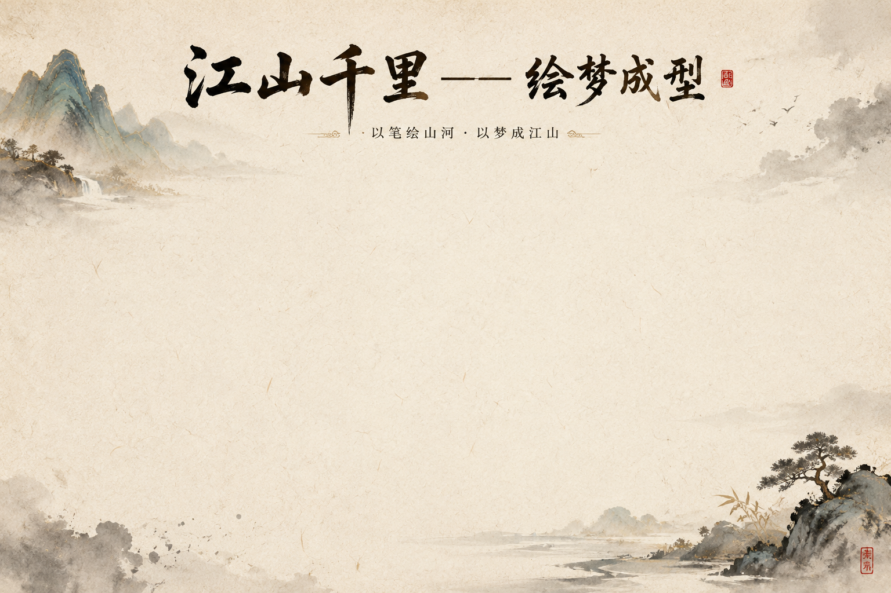

# 《江山千里——绘梦成型》

一个基于 Python + PyQt6 + MediaPipe 的中国山水数字绘画交互项目。
当前已实现摄像头手势输入、食指红点预览与水墨画布实时渲染。

## 功能概览
- 摄像头手势绘画输入（MediaPipe HandLandmarker）
- 画布实时墨迹扩散与持久化显示
- 食指红点预览叠层
- 背景画布（自动读取 `assets` 目录图片）

## 技术栈
- Python 3.11+
- PyQt6
- OpenCV
- MediaPipe Tasks
- Pillow
- NumPy
- Requests
- python-dotenv

## 快速开始

### 1. 克隆项目
```bash
git clone https://github.com/Kylerx233/KYle-s-creation.git
cd KYle-s-creation
```

### 2. 安装依赖
```bash
python -m pip install -r requirements.txt
```

### 3. 配置环境变量（AI 阶段预留）
```bash
cp .env.example .env
```
Windows PowerShell 可使用：
```powershell
Copy-Item .env.example .env
```

### 4. 准备手势模型文件
项目运行需要 `hand_landmarker.task`，请放在项目根目录：
`hand_landmarker.task`

若缺失可下载：
```bash
python -c "import urllib.request; urllib.request.urlretrieve('https://storage.googleapis.com/mediapipe-tasks/hand_landmarker/hand_landmarker.task','hand_landmarker.task'); print('saved')"
```

### 5. 启动应用
```bash
python main.py
```

## API Key 配置
当前版本的本地手势绘画功能不依赖 API Key。

后续接入 AI 生图阶段会使用 `.env` 中的密钥，例如：
- `OPENAI_API_KEY`
- `OPENAI_BASE_URL`（可选）
- `OPENAI_MODEL`（可选）

详见 [.env.example](.env.example)。

## 当前已完成 vs 计划中

### 已完成
- 基础 GUI 主窗口与画布
- 手势追踪输入（摄像头 + 食指绘制）
- 食指红点预览层
- 墨迹扩散与持续留痕
- 背景图自动加载（`assets/background.png` 或 `assets` 内首张图片）

### 计划中
- AI 图像生成管线接入
- 粒子互动与动态视觉优化
- 更完善的测试覆盖与 CI
- 参数面板与可视化调参

## 运行截图

> 当前项目中的背景画布示例（可替换为你的运行界面截图）



## 单元测试说明
运行测试：
```bash
python -m pytest -q
```

当前测试状态：
- 已提供 `tests/` 目录结构
- 当前仓库几乎无有效测试用例，执行后通常会显示 `no tests ran`
- 后续会补充手势输入与墨场核心逻辑测试

## 目录结构
```text
.
├─assets/
├─core/
├─tests/
├─ui/
├─main.py
└─requirements.txt
```

## License
本项目使用 MIT License，详见 [LICENSE](LICENSE)。
